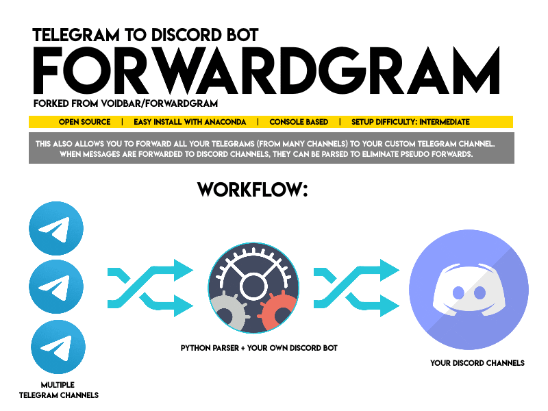

🚀 Telegram to Discord Forward Bot — Forward Telegram Messages to Discord

📣 Update
Check out the improved version here:
Telegram-To-Discord-Bot-Fixed

Need help or want to contribute? Join the Support & FAQ Discord

📋 Overview
Forwardgram is a free and open-source Python bot that automatically forwards messages from multiple Telegram channels to a Discord server, and optionally, to another Telegram channel.

Rebuilt from an open-source base, debugged, cleaned, and packed with useful documentation.

If this tool helps you, a ⭐ star on the repo would be appreciated!

🛠️ Requirements
Python 3.6+

(Optional) Anaconda for easier package management

A Telegram account with a valid phone number

A Discord bot with access to your server (How to get your bot token)

⚙️ Installation & Setup
1. Clone the Repository
bash
Copy
Edit
git clone https://github.com/aliazam1291/Telegram-To-Discord-Forward-Bot.git
cd Telegram-To-Discord-Forward-Bot
2. Install Dependencies
bash
Copy
Edit
python -m pip install -r requirements.txt
If python doesn’t work, try python3.

🔧 Configuration
Rename the file config.yml-sample to config.yml

Open config.yml and fill in the following:

Your api_id and api_hash (get it here)

Your discord_bot_token

Telegram channel IDs: channel_send, channel_receive

Discord channel ID: discord_1_channel

You can add multiple Telegram channels in the config directly.

✏️ Code Customization
Editing discord_messager.py
If you change the number of Discord channels in config.yml, you’ll also need to update:

The section under DISCORD SERVER START EVENT

The MESSAGE SCREENER logic

No changes needed for Telegram if you only modify the channel list in config.yml.